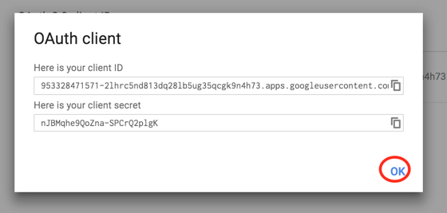

## GMAIL API SETUP

**Go to https://console.developers.google.com/start/api?id=gmail. We will use this wizard to create or select a project in the Google Developers Console and automatically turn on the API. Click Continue.**

**Click on the drop-down menu.**

**Click on a project named 'My Project'.**

**The drop-down will close. When you can do so, press the 'Go to credentials' button.**

**On the Add credentials to your project page, click the Cancel button.**

**Select the Credentials tab, click the Create credentials button**

**Select OAuth client ID.**

**At the top of the page, select the OAuth consent screen tab.**

**Select an Email address, enter a Product name if not already set, and click the Save button.**

**Select the application type Other, enter the name "Gmail API Quickstart", and click the Create button.**

**Click OK to dismiss the resulting dialog.**

**Click the file_download (Download JSON) button to the right of the client ID.**

This file should start with `client_secret_`. Move this file to the `Panorama` or `Panorama-master` directory (the directory this file is in, that you just downloaded).

**Lastly, execute `python3 gmail_0_setup.py`**

Note:
These instructions are adapted from [here](https://developers.google.com/gmail/api/quickstart/python).
